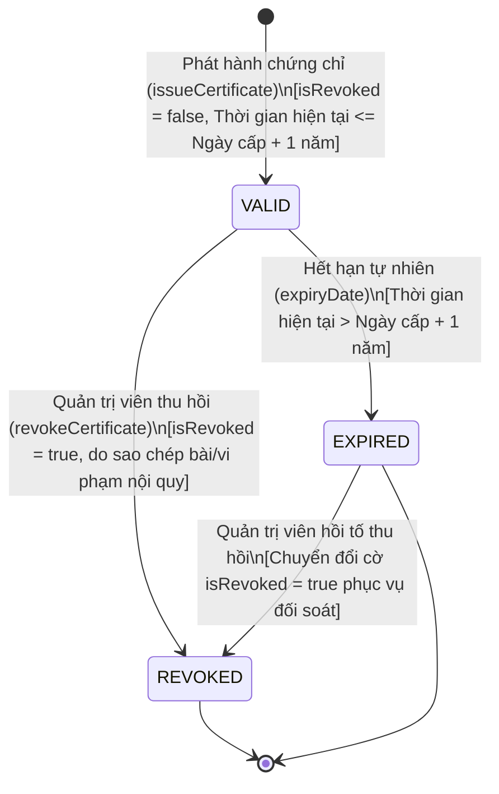

# Software Requirements Specification (SRS) - Hệ Thống Quản Lý Chứng Chỉ

Tài liệu này đặc tả các yêu cầu nghiệp vụ, thiết kế cấu trúc dữ liệu, thuật toán tra cứu và phân quyền cho tính năng quản lý chứng chỉ (Certificate Management) của hệ thống E-Learning, dựa trên yêu cầu từ phòng Khảo thí.

---

## 1. Thiết Kế Cấu Trúc Dữ Liệu (Data Structure Design)

Để lưu trữ thông tin chứng chỉ và đáp ứng các yêu cầu nghiệp vụ về thời hạn hiệu lực (1 năm) cũng như trạng thái thu hồi, chúng ta thiết kế thực thể mới mang tên `Certificate`.

### Thực thể `Certificate` (Bảng `certificates`)

Sơ đồ quan hệ thực thể (Entity Relationship):
- Một `User` (Học viên) có thể nhận được nhiều `Certificate` (Mối quan hệ **1 - Nhiều**).
- Một `Course` (Khóa học) có thể cấp nhiều `Certificate` cho các học viên khác nhau (Mối quan hệ **1 - Nhiều**).
- Do đó, thực thể `Certificate` có mối quan hệ **Nhiều - 1 (ManyToOne)** với cả `User` và `Course`.

#### Các thuộc tính chi tiết:

| Tên trường (Attribute) | Kiểu dữ liệu | Ràng buộc | Mô tả |
| :--- | :--- | :--- | :--- |
| `id` | `Long` | Primary Key, Auto Increment | Mã số tự tăng của bản ghi định danh chứng chỉ. |
| `certificateCode` | `String` / `UUID` | Unique, Not Null | Mã chứng chỉ duy nhất dùng để tra cứu công khai (ví dụ: `CERT-2026-XXXX`). |
| `user` | `User` | ManyToOne, JoinColumn(`user_id`), Not Null | Tham chiếu đến học viên nhận chứng chỉ. |
| `course` | `Course` | ManyToOne, JoinColumn(`course_id`), Not Null | Tham chiếu đến khóa học được cấp chứng chỉ. |
| `issuedDate` | `LocalDateTime` | Not Null | Ngày và giờ cấp chứng chỉ. Dùng làm mốc tính thời hạn hết hạn. |
| `isRevoked` | `Boolean` | Not Null, Default: `false` | Cờ đánh dấu trạng thái bị thu hồi (`true` nếu bị thu hồi, `false` nếu bình thường). |
| `revokedAt` | `LocalDateTime` | Nullable | Thời điểm thực hiện hành động thu hồi chứng chỉ. |
| `revokeReason` | `String` | Nullable | Lý do thu hồi (ví dụ: "Học viên có hành vi gian lận thi cử"). |

#### Giải thích thiết kế đáp ứng yêu cầu:
- **Yêu cầu thời hạn (1 năm)**: Hệ thống **không cần lưu cứng** trường ngày hết hạn (`expiryDate`) trong cơ sở dữ liệu để tuân thủ quy chuẩn chuẩn hóa dữ liệu (Database Normalization). Thời hạn hết hạn sẽ là 1 năm tính từ ngày cấp (`issuedDate.plusYears(1)`). Việc tính toán động giúp đảm bảo dữ liệu không bị thừa và tránh xung đột dữ liệu.
- **Yêu cầu thu hồi (Revoke)**: Sử dụng trường `isRevoked` làm cờ boolean. Khi quản trị viên phát hiện gian lận và thu hồi chứng chỉ, cờ này sẽ chuyển sang `true`, đồng thời ghi nhận lý do tại `revokeReason` và mốc thời gian tại `revokedAt` để có thông tin đối soát.

### 1.2. Luồng Máy Trạng Thái Của Chứng Chỉ (State Machine Diagram)

Vòng đời của chứng chỉ từ lúc phát hành đến lúc kết thúc được mô tả chi tiết thông qua sơ đồ chuyển trạng thái dưới đây:



#### Giải thích các chuyển dịch trạng thái (Transitions):
1. **Khởi tạo (`VALID`)**: Khi sinh viên đủ điều kiện hoàn thành khóa học, Admin cấp chứng chỉ qua API, chứng chỉ ở trạng thái ban đầu là `VALID` (Hợp lệ).
2. **Hết hạn (`EXPIRED`)**: Sau khi thời gian vượt quá `issuedDate + 1 năm`, hệ thống tự động nhận diện chứng chỉ đã chuyển sang trạng thái `EXPIRED` (Đã hết hạn). Trạng thái này được tính toán động khi truy vấn tài nguyên.
3. **Bị thu hồi (`REVOKED`)**: Nếu quản trị viên thu hồi chứng chỉ (bằng cách chuyển `isRevoked = true`) tại bất kỳ thời điểm nào (kể cả khi chứng chỉ còn hạn hay đã hết hạn) để xử phạt vi phạm học thuật, chứng chỉ sẽ chuyển dịch vĩnh viễn sang trạng thái thất bại `REVOKED`. Mọi hành động tra cứu công khai đối với trạng thái này sẽ bị chặn và báo lỗi 400.

---

## 2. Đặc Tả Thuật Toán Tra Cứu (Lookup Algorithm Specification)

Khi học viên hoặc bên thứ ba tra cứu mã chứng chỉ, hệ thống thực hiện tiến trình giải thuật bên dưới nhằm kiểm tra các điều kiện về trạng thái vi phạm và thời hạn hiệu lực trước khi trả về kết quả.

### Luồng logic thuật toán (Pseudo-code)

```text
Hàm: lookupCertificate(inputCode)
Đầu vào: inputCode (Mã chuỗi chứng chỉ cần tra cứu)
Đầu ra: Đối tượng phản hồi chứa trạng thái chứng chỉ hoặc thông báo lỗi

BẮT ĐẦU
    1. Tìm kiếm chứng chỉ trong cơ sở dữ liệu:
       certificate = Tìm Certificate theo certificateCode == inputCode
       
    2. Nếu không tìm thấy certificate (certificate == null):
       Trả về mã lỗi 404 Not Found với thông điệp: "Không tìm thấy chứng chỉ với mã đã nhập."
       
    3. Nếu tìm thấy certificate:
       
       A. Kiểm tra trạng thái thu hồi (Hành vi gian lận):
          Nếu certificate.isRevoked == true:
              Trả về mã lỗi 400 Bad Request (hoặc Custom Response Error) với thông điệp:
              "Chứng chỉ không hợp lệ do vi phạm!"
              
       B. Kiểm tra thời hạn hiệu lực (Thời hạn 1 năm):
          Thời_gian_hết_hạn = certificate.issuedDate + 1 năm
          Thời_gian_hiện_tại = Thời gian hệ thống hiện tại (now)
          
          Nếu Thời_gian_hiện_tại > Thời_gian_hết_hạn:
              Trả về phản hồi thành công kèm theo:
                  - Các thông tin cơ bản của chứng chỉ
                  - Trạng thái hiển thị hiển thị: "Đã hết hạn" (Expired)
                  
       C. Nếu cả hai điều kiện trên đều không bị vi phạm (Hợp lệ):
          Trả về phản hồi thành công kèm theo:
              - Tên học viên: certificate.user.fullName
              - Tên khóa học: certificate.course.title
              - Ngày cấp: certificate.issuedDate
              - Ngày hết hạn: Thời_gian_hết_hạn
              - Trạng thái hiển thị: "Hợp lệ" (Valid)
KẾT THÚC
```

---

## 3. Đặc Tả Phân Quyền (Authorization Specification)

Hệ thống phân quyền truy cập cho các API quản lý chứng chỉ dựa trên hai vai trò người dùng chính là **Học viên (STUDENT)**, **Quản trị viên (ADMIN)** và đối tượng người dùng vãng lai **(PUBLIC - Khách tuyển dụng/Cơ quan xác minh)**.

| STT | Địa chỉ đường dẫn (API Endpoint) | Phương thức (Method) | Phân quyền truy cập | Giải thích lý do nghiệp vụ |
| :--- | :--- | :--- | :--- | :--- |
| **1** | `/api/v1/certificates/lookup/{code}` | `GET` | **PUBLIC** (Không cần token đăng nhập) | Bất kỳ ai (bao gồm cả nhà tuyển dụng hay bên kiểm tra độc lập) đều có thể kiểm tra trực tiếp tính xác thực và thời hạn của chứng chỉ bằng cách nhập mã code có sẵn, đảm bảo tính thuận tiện cao. |
| **2** | `/api/v1/certificates/my` | `GET` | **STUDENT** (Yêu cầu Token, có vai trò `STUDENT`) | API này trả dữ liệu danh sách chứng chỉ riêng của học viên đang đăng nhập. Yêu cầu xác thực nhằm tránh lộ thông tin học tập cá nhân của người học khác. |
| **3** | `/api/v1/admin/certificates/revoke/{code}` | `POST` / `PUT` | **ADMIN** (Yêu cầu Token, có vai trò `ADMIN`) | Thu hồi chứng chỉ là tác vụ nhạy cảm liên quan đến danh dự và bằng cấp chuyên môn của sinh viên. Chỉ có Admin sau khi kiểm định gian lận mới có thẩm quyền thực thi tác vụ này. |
| **4** | `/api/v1/admin/certificates/issue` | `POST` | **ADMIN** (Yêu cầu Token, có vai trò `ADMIN`) | Chỉ quản trị viên hệ thống hoặc quy trình tự động được bảo mật cao mới được quyền cấp phát chứng chỉ mới khi sinh viên đủ điều kiện tốt nghiệp khóa học. |
